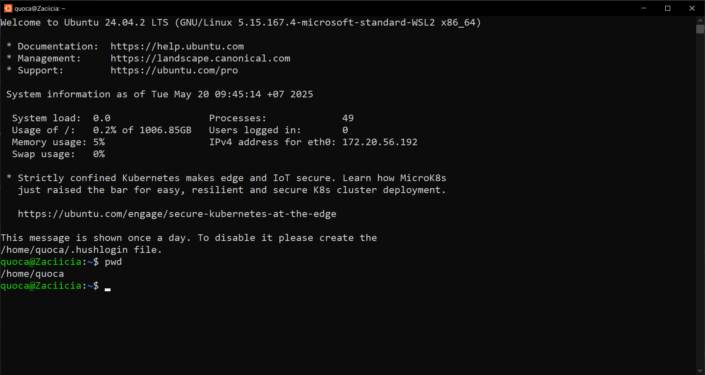

# Homework 1: Linux Command Line Basics
Complete the following tasks by using appropriate Linux commands. For each task, provide: 
1. The command(s) you used 
2. A brief explanation of how the command solves the problem 
3. Any output you generated (screenshots) 

> Task 1: System Investigation 
* Find out what directory you are currently in.

* Go to the Documents directory inside your home directory using a relative path. 
* Confirm your new location. 

> Task 2: Directory Setup 
* Create a folder named project_logs in your current directory. 
* Inside it, create subfolders old_backup, archive, and current. Then, create a file temp.txt. 
* Verify that they exist.

> Task 3: Log Review 
* You received a system log file at /var/log/syslog. 
* Display the last 10 lines and the first 5 lines of the file. 
* Reverse the content of the file for a quick scan. 

> Task 4: Pattern Search 
* Search for all lines that contain the word error (case-insensitive). 
* Save only these lines to a file called errors.log. 
* Count how many such lines exist. 

> Task 5: Stream Redirection 
* Redirect the list of all files in /etc into a file named etc_list.txt without showing it on screen. 
* Append the list of files from /bin to the same file. 
* View the result one page at a time. 

> Task 6: Text Processing 
Create a file users.txt with the following content: 

Alice:Admin 

Bob:User 

Carol:Guest 
* Use cut or awk to extract just the usernames. 
* Use tr to convert them to lowercase. 
* Use sort to display them in reverse alphabetical order. 

> Task 7: Cleanup Script 
* Remove an empty directory named old_backup 
* Delete a file named temp.txt 
* Move a file report.txt to the archive folder 
* Copy archive/report.txt to current/report_backup.txt 

> Task 8: File Hunting 
* Find all .conf files under /etc 
* Find all files with 755 permission in your home directory 
* Find all directories under /usr that contain the word lib 

> Task 9: Joining Data 
* Create two files: 

names.txt: 

1 Alice 

2 Bob 

3 Carol 

roles.txt: 
1 Admin 

2 User 

3 Guest 
* Join them into one file with both name and role. 

> Task 10: Line Numbering & Word Counts 
* Use nl to number the lines of users.txt 
* Use wc to count: 
    * Number of lines 
    * Number of words 
    * Number of bytes in users.txt 

> Submission Format 

Submit a markdown file (student_id.md) and its exported PDF file (student_id.pdf) that 
includes: 
* Your command for each task 
* Short explanation 
* Output snippets (or screenshots if needed) 