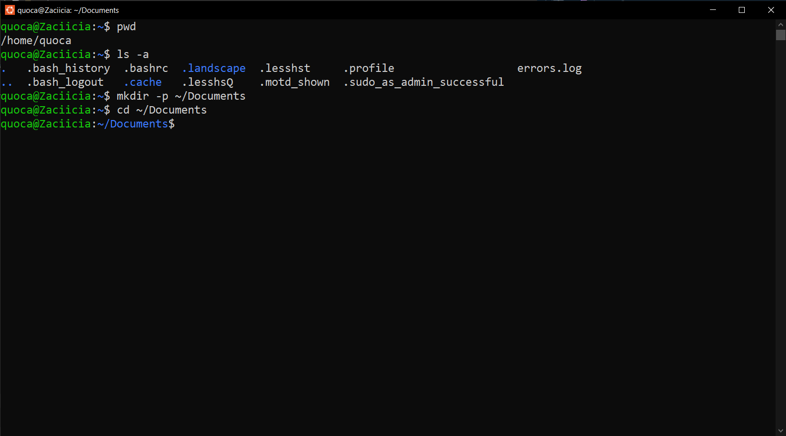

# Homework 1: Linux Command Line Basics

Complete the following tasks by using appropriate Linux commands. For each task, provide:

1. The **command(s)** you used
2. A **brief explanation** of how the command solves the problem 
3. Any **output** you generated (screenshots)

> Task 1: System Investigation

* Find out what directory you are currently in.  
* Go to the **Documents** directory inside your home directory using a **relative path**.
* Confirm your new location.

<ins>**Command(s) used**</ins>:  
pwd  
ls -a  
mkdir -p ~/Documents  
cd ~/Documents  
pwd  

<ins>**Explanation**</ins>:

* *pwd* shows current working directory.
* *ls lists directory contents (which does not have Documents)
* As such, I use *mkdir -p ~/Documents* (flag *-p* create the parent directory if it does not exists) and then *cd ~/Documents* to change directory to Documents
* Again, *pwd* shows current working directory.

> Task 2: Directory Setup

* Create a folder named project_logs in your current directory.  
* Inside it, create subfolders old_backup, archive, and current. Then, create a file temp.txt.
* Verify that they exist.

<ins>**Command(s) used**</ins>:  
mkdir project_logs  
cd project_logs  
mkdir old_backup archive current  
ls  
touch temp.txt  
ls

<ins>**Explanation**</ins>:

* *mkdir* create a new directory,
* *ls* lists directory contents (here, for verification),
* *touch* creates a new empty file
* *cat* can be used to view file's content, however there's nothing to view here.

> Task 3: Log Review

* You received a system log file at /var/log/syslog.
* Display the **last 10 lines** and the **first 5 lines** of the file.
* Reverse the content of the file for a quick scan.

<ins>**Command(s) used**</ins>:  
tail -10 /var/log/syslog  
head -5 /var/log/syslog  
tac /var/log/syslog | less

<ins>**Explanation**</ins>:

* *head/tail* views the first/last lines of data
* *-10* and *-5* limits output to said number of lines
* *tac* is the reverse of *cat* (displays file contents from the end to the beginning)
* paging with *less* provides more flexible navigation

> Task 4: Pattern Search

* Search for all lines that contain the word error (case-insensitive).
* Save only these lines to a file called errors.log.
* Count how many such lines exist.

<ins>**Command(s) used**</ins>:  
grep -i "error" /var/log/syslog > errors.log  
wc -l errors.log

<ins>**Explanation**</ins>:

* *grep* to search content
* flag *-i* to case-insensitive search for "error"
* *>* sends output to errors.log
* *wc -l* counts lines in errors.log

> Task 5: Stream Redirection

* Redirect the list of all files in /etc into a file named etc_list.txt without showing it on screen.
* Append the list of files from /bin to the same file.
* View the result one page at a time.

<ins>**Command(s) used**</ins>:  
ls /etc > etc_list.txt  
ls /bin >> etc_list.txt

<ins>**Explanation**</ins>:

* *ls* lists directory contents (here, for verification),
* *>* sends output to etc_list.txt
* *>>* appends output to etc_list.txt
* paging with *less* provides more flexible navigation

> Task 6: Text Processing
Create a file users.txt with the following content:  
Alice:Admin  
Bob:User  
Carol:Guest

* Use cut or awk to extract just the usernames.
* Use tr to convert them to lowercase.
* Use sort to display them in reverse alphabetical order.

<ins>**Command(s) used**</ins>:  
echo -e "1 Alice:Admin\n2 Bob:User\n3 Carol:Guest" > users.txt
cut -d: -f1 users.txt | tr '[:upper:]' '[:lower:]' | sort -r

<ins>**Explanation**</ins>:

* *echo* prints a string to the screen
* flag *-e* enables *\n* to create new lines
* flag *-d* sets colon as delimiter
* flag *-f1* selects first field (username)
* *tr '[:upper:]' '[:lower:]'* converts them to lowercase
* flag *-r* displays in reverse alphabetical order

> Task 7: Cleanup Script

* Remove an empty directory named old_backup
* Delete a file named temp.txt
* Move a file report.txt to the archive folder
* Copy archive/report.txt to current/report_backup.txt

<ins>**Command(s) used**</ins>:  
rmdir old_backup  
rm temp.txt  
ls temp.txt  
touch report.txt  
mv report.txt archive/  
ls archive/  
mkdir -p current && cp archive/report.txt current/report_backup_txt  

<ins>**Explanation**</ins>:

* *rmdir* deletes an empty directory
* *rm* deletes files
* *mv* moves files to folder (create said folder if it doesn't exist)
* *cp* copies files
* flag *-p* creates the parent directory if it does not exists

> Task 8: File Hunting

* Find all .conf files under /etc
* Find all files with 755 permission in your home directory
* Find all directories under /usr that contain the word lib

<ins>**Command(s) used**</ins>:  
sudo find /etc -type f -name .conf"
find -type f -perm 755
sudo find /usr -type d -name **lib*

<ins>**Explanation**</ins>:

* *sudo* to access root permissions
* *find* searches for files and directories
* flag *-type f*: only regular files
* *-name "*.conf"* match .conf extension
* *~*: user's home directory
* *-perm 755*: exact permission match (rwxr-xr-x)
* *-type f*: files only (exclude directories)
* *-type d*: directories only
* *lib*: name contains "lib" (case-sensitive)

> Task 9: Joining Data

* Create two files:  
names.txt:  
1 Alice  
2 Bob  
3 Carol  
roles.txt:  
1 Admin  
2 User  
3 Guest

* Join them into one file with both name and role.

<ins>**Command(s) used**</ins>:  
echo -e "1 Alice\n2 Bob\n3 Carol" > names.txt
echo -e "1 Admin\n2 User\n3 Guest" > roles.txt
join names.txt roles.txt > combined.txt

<ins>**Explanation**</ins>:

* *echo* prints a string to the screen
* flag *-e* enables *\n* to create new lines
* *join* to join files' contents
* *cat* to print file's content to check

> Task 10: Line Numbering & Word Counts

* Use nl to number the lines of users.txt
* Use wc to count:
  * Number of lines
  * Number of words
  * Number of bytes in users.txt

<ins>**Command(s) used**</ins>:  
echo -e "1 Alice\n2 Bob\n3 Carol" > names.txt

<ins>**Explanation**</ins>:

* *nl* number the lines of the current directory,
* *wc* prints (in order) number of lines, words & bytes in the the current directory

