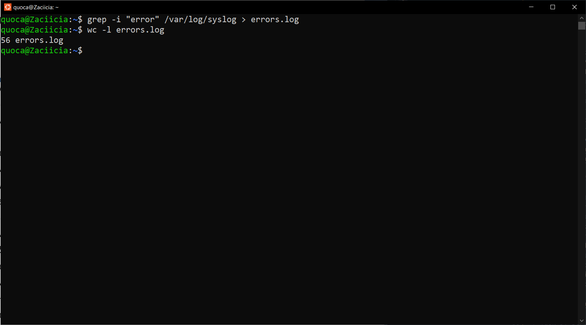
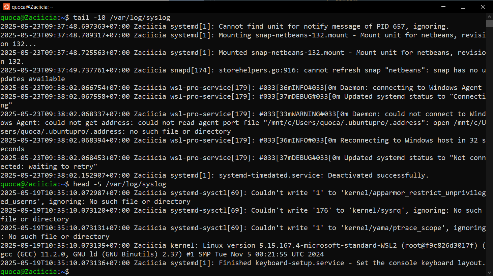

# Homework 1: Linux Command Line Basics
Complete the following tasks by using appropriate Linux commands. For each task, provide: 
1. The **command(s)** you used 
2. A **brief explanation** of how the command solves the problem 
3. Any **output** you generated (screenshots) 

> Task 1: System Investigation 
* Find out what directory you are currently in.

<ins>**Explanation**</ins>: *pwd (**p**rint **w**orking **d**irectory)* shows full path of current directory.

* Go to the **Documents** directory inside your home directory using a **relative path**. 

<ins>**Explanation**</ins>: 
    - *ls (**l**i**s**t)* displays the contents of the current directory (which does not have the Documents directory)
    - As such, I create it using *mkdir -p ~/Documents* (**m**a**k**e **dir**ectory) (*-p* ensures no error is thrown if the directory already exists) and then go to the Documents directory inside your home directory using *cd ~/Documents*
* Confirm your new location.

<ins>**Explanation**</ins>:
    - Again, using *pwd (**p**rint **w**orking **d**irectory)* shows full path of current directory.

> Task 2: Directory Setup 
* Create a folder named project_logs in your current directory.
* Inside it, create subfolders old_backup, archive, and current. Then, create a file temp.txt. 
* Verify that they exist.

<ins>**Explanation**</ins>: 
    - Create folder using *mkdir*, 
    - list items in folder using *ls*
    - create file using *touch* (creates an empty file if it doesn't exist, else it updates the timestamp without changing the file's content)

*cat* can be used to view the file's content, however there's nothing to view here.

> Task 3: Log Review 
* You received a system log file at /var/log/syslog. 
* Display the **last 10 lines** and the **first 5 lines** of the file.

* Reverse the content of the file for a quick scan. 

<ins>**Explanation**</ins>: 
    - *sudo* to access root permissions
    - *head/tail* shows the start/end of a file
    - *-n 10* and *-n 5* limits output to said number of lines

> Task 4: Pattern Search 
* Search for all lines that contain the word error (case-insensitive). 
* Save only these lines to a file called errors.log. 
* Count how many such lines exist. 

<ins>**Explanation**</ins>: 
    - *sudo* to access root permissions
    - grep -i performs case-insensitive search for "error"
    - *>* redirects output to errors.log
    - wc -l counts lines in errors.log

> Task 5: Stream Redirection 
* Redirect the list of all files in /etc into a file named etc_list.txt without showing it on screen. 
* Append the list of files from /bin to the same file.

* View the result one page at a time. 

<ins>**Explanation**</ins>: 
    - *ls* list files in /etc
    - *>* redirects output (overwrites if file exists)
    - *>>* appends output instead of overwriting
    - *less* to view the file one page at a time. 

> Task 6: Text Processing 
Create a file users.txt with the following content: 

Alice:Admin 

Bob:User 

Carol:Guest 
* Use cut or awk to extract just the usernames. 
* Use tr to convert them to lowercase. 
* Use sort to display them in reverse alphabetical order. 

<ins>**Explanation**</ins>: 
    - *echo* to access root permissions
    - *-e* enables interpretation of escape characters
    - *>* redirects output
    - *-d* sets colon as delimiter 
    - *-f1* selects first field (username)
    - *cut* extracts usernames (as above)
    - *tr '[:upper:]' '[:lower:]'* convert them to lowercase (as above) 
    - *sort -r* to display them in reverse alphabetical order (as above)

> Task 7: Cleanup Script 
* Remove an empty directory named old_backup 
* Delete a file named temp.txt 
* Move a file report.txt to the archive folder 
* Copy archive/report.txt to current/report_backup.txt 

<ins>**Explanation**</ins>: 
    - *rmdir*: **r**e**m**oves **dir**ectories (if the folder is empty, will fail if isn't)
    - *rm*: **r**e**m**oves files
    - *mv*: **m**o**v**es files to folder (create one if it doesn't exist)
    - *cp*: **c**o**p**y files to another file

> Task 8: File Hunting 
* Find all .conf files under /etc 

* Find all files with 755 permission in your home directory

* Find all directories under /usr that contain the word lib 

<ins>**Explanation**</ins>: 
    - *sudo* to access root permissions
    - *-type f*: only regular files
    - *-name "*.conf"*: Match .conf extension
    - *~*: Current user's home directory
    - *-perm 755*: Exact permission match (rwxr-xr-x)
    - *-type f*: files only (exclude directories)
    - *-type d*: directories only
    - *lib*: n ame contains "lib" (case-sensitive)

> Task 9: Joining Data 
* Create two files: 

names.txt: 

1 Alice 

2 Bob 

3 Carol 

roles.txt: 
1 Admin 

2 User 

3 Guest 
* Join them into one file with both name and role. 

<ins>**Explanation**</ins>: 
    - *sudo* to access root permissions
echo -e "1 Alice\n2 Bob\n3 Carol" > names.txt
echo -e "1 Admin\n2 User\n3 Guest" > roles.txt
join names.txt roles.txt > combined.txt

> Task 10: Line Numbering & Word Counts 
* Use nl to number the lines of users.txt 
* Use wc to count: 
    * Number of lines 
    * Number of words 
    * Number of bytes in users.txt 

<ins>**Explanation**</ins>: 
    - *nl (**n**umber **l**ines)* number the lines of the current directory, 
    - *wc* prints, in order, number of lines, words & bytes in the the current directory 